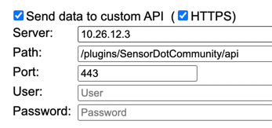
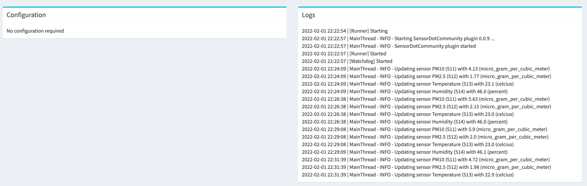

# Hue

A Sensor.community plugin, for reading out particulate matter sensors by sensors.community (formerly known as luftdaten).
Also see: https://sensor.community/en/sensors/airrohr/

## Configuration

This plugins requires zero configuration on the plugin side.

You do need to configure the particulate matter device with the following values:

## Sensors

Whenever the device starts sending data, the OM gateway will register the required sensors and populate them with the latest values.
From now on, all sensors can be used just as built-in sensors.

## Logs
